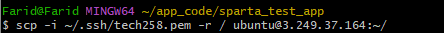
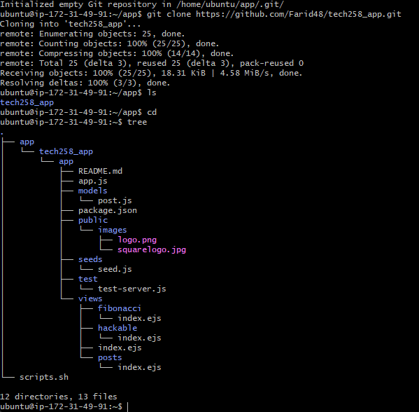

# How to Deploy a working app

## Linux Script Command:
```
#!/bin/bash
 
echo updating...
sudo apt update -y
echo done!

# fix this command, asks for user input
echo upgrading...
sudo DEBIAN_FRONTEND=noninteractive apt upgrade -y
# Suppresses user prompts and prevents interactions that are required
echo done!

# Requires user input
echo installing nginx...
sudo DEBIAN_FRONTEND=noninteractive apt install nginx -y
echo done!

# configure reverse proxy
# changing configuration file

echo restarting nginx...
sudo systemctl restart nginx
echo done!

echo enabling nginx...
sudo systemctl enable nginx
echo done!

# install node.js
echo installing node.js
curl -fsSL https://deb.nodesource.com/setup_20.x | sudo DEBIAN_FRONTEND=noninteractive -E bash - &&\
sudo DEBIAN_FRONTEND=noninteractive apt-get install -y nodejs
echo installed node.js

# installing pm2 
echo installing PM2...
sudo npm install -g pm2
echo PM2 installed

# checking version
echo checking node js version...
node -v
echo done!

# Get the app code of the app folder
echo cloning git repo...
git clone https://github.com/Farid48/tech258_app.git
echo done cloning repo...

# npm install in the app folder
cd ~/tech258_app/app/
echo inside app directory
echo installing npm
sudo npm install
echo installed npm

# stop all running instances
sudo pm2 stop all

# Running
echo starting....
sudo pm2 start app.js

echo done


scripts need to be keep tested for fresh and existing environments, it also needs to run multiple times without causing problems.


copy file from my system:

scp -i ~/.ssh/tech258/pem -r ~/app_code/sparta_test_app /ubuntu@3.249.37.164:~/app


copy files from github:

Initialise the app folder to be a repo
clone the repo from github

```
git clone (https://github.com/Farid48/tech258_app.git) # example - replace the brackets with your repo
all of it should appear




