# Linux Commands

## Check the current shell we are using

```
-ps -p $$ # OR 1330 - these 2 are interchangeable 
```
**ps** - all the processes that are currently running

**p** - Select a specific process (which is the next argument)

**$$** - short form for 1330, which will allow you to check your shell

## Check History

```
history # to check history
history -c # Clear history
```

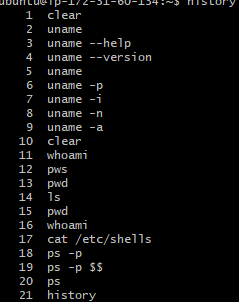

## List all the shells in the system

```
cat /etc/shells # outputs all the shells that are installed
```
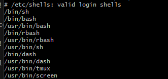

## Download a file

```
curl "ENTER YOU URL" --output "FILENAME".jpg 
```

## Move and Rename a file
```
mv cat.jpg cat # Will rename cat.jpg to cat, but linux will still remember that it is still a jpg

mv cat funny_jokes/funny_images # Ths will move the cat file to the funny_image directory

file cat # checks the file type of the file called "cat"

```
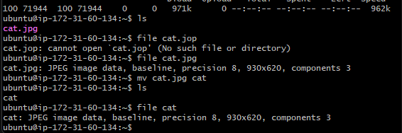

Example of moving a file:

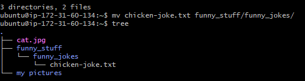

How to move a file back to the current directory (in this case back to the home):

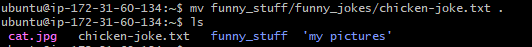


## Copy and Remove Files
```
cp cat cat.jpg # will copy the cat file and name it as cat.jpg

rm cat # will remove the cat file

rm -r funny_jokes # will remove the directory of the folder (-r means recursive, so it deletes everything inside)

rf # means recursive force, this will forcefully remove all the files, however, if there are no arguments after it, it will delete all the files on linux.
```
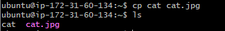

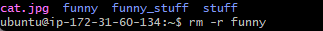


linux is case sensitive 

### Task 1

print top 2 lines of the file:

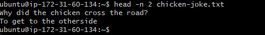

print bottom 2 lines of the file:

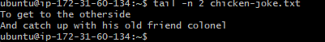

number the lines:

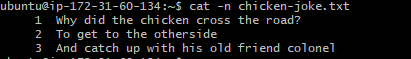

find all the lines where chicken was ued:

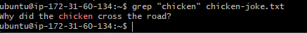


### Creating a script


`#!/bin/bash` - This is the shell we want to use, so we have to state what shell we have to use in the nano 

#### Example Script
```
sudo apt update -y  # Ensure this is saved inside a file with any name with the extension . sh
```

You can run this script by typing `./FILENAME.sh`


```chmod 777 provision.sh```


first is current user, second is groups of users, and the last one is everyone else

```RWXRWXRWX``` - long form

read = +4 <br>
write = +2     ------> CHMOD short form <br>
execute = +1  

[chmod calc](https://chmod-calculator.com/)


# Linux Processes

## Killing Processes:

#### Gentle Killing:

```
kill -1
```
This command is like polity asking someone to stop. This means that sometimes it will fail to stop the processes

#### Default killing:

```
kill -15
```
This is the default kill switch, even if you run `kill` on it's own, it will be this code. This will try kill all the children processes first, and then kill the parent node. This will try not to create any zombie nodes.

#### Brute Force Killing:
```
kill -9
```
This is highly not recommended as it can create zombie processes, which are processes that aren't being used but are taking up memory. This will imidiately kill the parent node without going through to the children nodes.


## Check all Processes:

There are multiple commands you can use for this such as:

```
top
```
This lists all the current processes that are live, and in live time. You can them press SHIFT + M to the processes that are consuming more memory at the top. SHIFT + N will order it by ID, and SHIFT + P for processes.

```
ps aux
```
This is another command, however, it is not in a live view, and you cannot filter according to ID or most memory.

```
jobs -l
```
This will list all the current jobs, such as the `sleep` command. It will also list what is going on with them, such as processing, terminated or killed.

