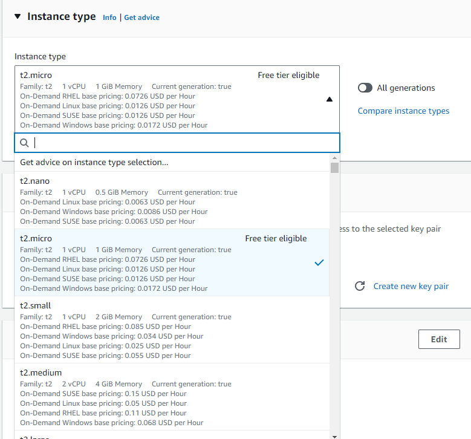
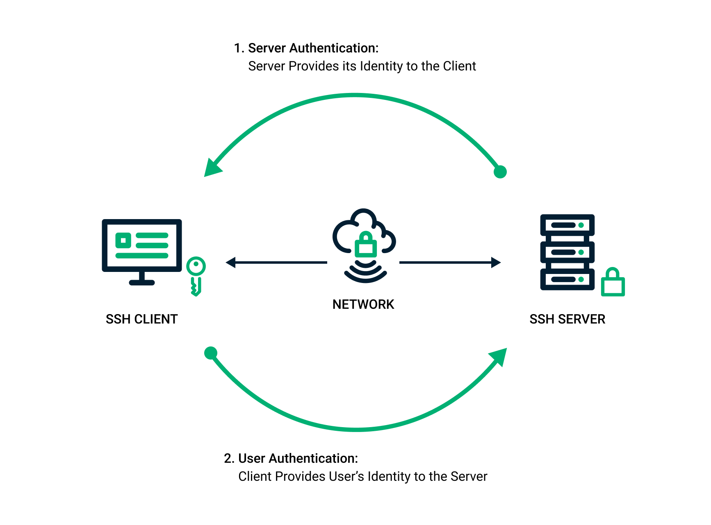
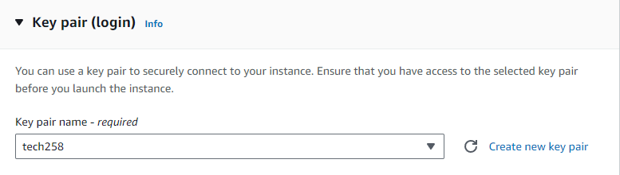
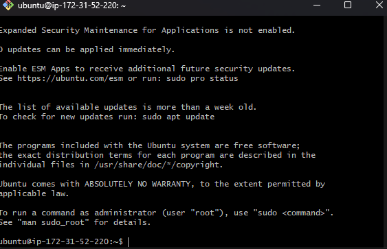

# How to Deploy a Virtual Machine on AWS

This is a tutorial on how to create your own Virtual Machine on AWS, in which we will use Ubuntu to deploy nginx on it. Nginx is a type of web client we can deploy off the command-line inside Ubuntu.

## Creating EC2 Instance in AWS

1) First of all, you would need to have a valid AWS credentials. Once logged in, on the top there should be search bar where you should type up "EC2". EC2 stands for Elastic Compute Cloud, and is basically a virtual machine. A virtual machine is separate environment to your OS but it uses your systems resources such as storage and memory. As we are running this on AWS, this instance will be using AWS's resources to create this VM.


2) Once the EC2 Service is open, press the bright orange button called "Launch Instance". You will then be put into a different menu where you will be required to edit to adjust this instance. First of all we need to give this instance an adequate name. For this example I will be calling it "tech258_farid_ec2_tutorial".

3) Once giving this instance an appropriate name, you can scroll down a bit to "Application and OS Images". This is where you would select the OS you would run. Naturally, the more resources that are required to run your OS, the more it will cost you, so ensure you select the correct OS you want to run.

### What is a machine Image?

A machine Image is a snapshot or a template used to create VM instances in a cloud environment. AMI's contain:
* The Operating System
* Software configurations
* Data required to launch a VM within a cloud environment

For this tutorial, I will be using Ubuntu so that will bes selected for me. But if you require another OS, you can select them from the quick start menu. If you require a different server, you can go under the AMI heading and select one of those option, but for now I will be using the free tier.


4) Just below AMI's, there is a section called "Instance Type". This is quite important depending on the use for the VM. The more computing power you require, the more it will cost, so you should select a more advance instance type. For this scenario, we will be using the default called "t2.micro".



5) You should now be on the Key Pair (Login) section. This part is very important to securely connect to your instance.
   
### What are SSH Keys?

SSH stands for Secure Socket Shell. SSH is a protocol method for securely sending commands to a computer. SSH uses cryptography to authenticate and encrypt connections between devices. When creating SSH Keys, you are provided with two. One of them is known as the public key in which anyone can see but cannot get access to. This can be seen as a padlock. The second key that is generated is the private key which should be kept safe and nobody should have access to it. This can be seen as the key for the padlock, as to get access to the other side, you require both pairs.



Ensure you have your SSH key pairs stored securely in your .ssh folder. Make sure the names match with what you have selected on AWS.



6) Network Settings are very important to set up. This is so you can get access to your VM without having any issue.

### What are Security Groups? What are Ports?

Security Groups can be defined as Firewalls. They essentially manage what can interact with your firewall and manage all the incoming traffic. They can block traffic coming from a certain region or only accept traffic from a certain person. Ports can be defined as virtual endpoints for network communication where the traffic can enter to interact with the VM. So for example, if we use port 80, HTTP requests will be accepted as incoming traffic. Ports also can do stuff like port forwarding, where traffic has arrived at a different port, and it gets redirected to the port that can deal with it.

In this scenario, we will be creating a new security group so that SSH and HTTP requests can go through. So in the network tab, press edit at top right. Make sure you change the name of your security group to a similar name to your EC2 Instance, and adjust the description accordingly.

Under "Inbound Security Group Rules", change some of the setting so that they match your needs. For example, change SSH's Source type to "My IP" so that traffic from your IP is only accepted, even if the person has the ssh key pairs.


7) Once all of that has been sorted out. You can launch your instance. This will take a few seconds. Once your instance has been successful, there should be a green bar at the top, which you should click the link inside to display your Instance Settings. This will launch a new tab, which you should wait for the status of your VM to be running. Click the highlighted link, this will expand the view of your instance, and then you can click connect towards the top right.


8) Once selecting Connect, you should be able to see how to connect to your SSH client. In this case we will be using Git Bash as our SSH client. Make sure you are in your ssh folder inside Git Bash and follow these commands to enter your instance.
   
```
chmod 400 "tech258.pem" # Change the name according to the name of your ssh key

ssh -i "tech258.pem" ubuntu@ec2-34-242-228-165.eu-west-1.compute.amazonaws.com

# Change the names according to the instructions you see on AWS
```

You should now be in your Ubuntu Instance. There are still a few more commands to follow in order to create your web client.



```
sudo apt update -y

sudo apt upgrade -y

sudo apt install nginx -y

systemctl status nginx
```

Copy the public IP to load your website. 

When VM not in use, make sure to terminate it so no extra cost occur.